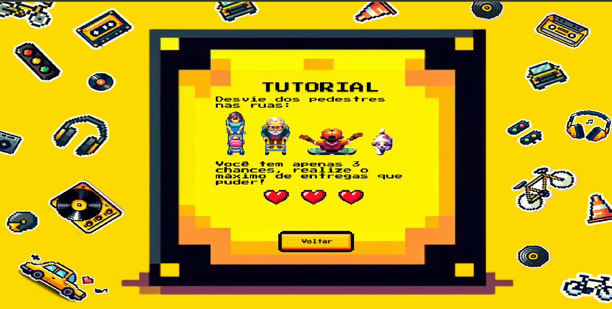
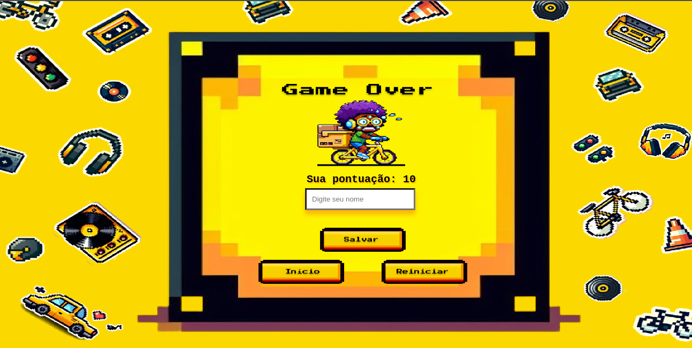

# DJlivery-jogo

DJlivery é um jovem que a noite é DJ e pelas manhã trabalha entregando delivery em sua bike. Ajude DJlivery nas suas entregas desviando os obstáculos!

* Link do jogo: https://djlivery-jogo.vercel.app/

## Motivação

A motivação é criar um jogo que seja fácil, divertido, acessível, competitivo e curto para a disciplina de estágio 1. Além disso, aprimorar e explorar o desenvolvimento da área de jogos, como dinâmicas e conceitos.

## Objetivo

O objetivo do jogo é proteger o personagem principal DJlivery por mais tempo e conseguir uma maior pontuação, fazendo ele continuar nas suas entregas.

## Valor Agregado

Agregar e explorar novas dinâmicas no desenvolvimento de jogos.

## Fases

Nessa fase inicial, o jogo terá apenas uma fase corrida de sobrevivência, apesar de que posteriormente possa ter fases individuais. O que muda na fase é que ela vai ficando mais rápida e portanto, mais difícil de proteger o personagem, os obstáculos vão aparecendo mais rápidos, as sequências também e afins.

Apesar disso, a fase corrida possui 3 ciclos basicamente: 

1 - O personagem inicia no centro da tela e precisa se mover para os lados para buscar os primeiros pontos. Nessa fase do ínicio, não aparecem obstáculos.

2 - Apartir do 3 ponto de entrega, aparecem na pista da fase os primeiros obstáculos, dessa forma, aumentando a dificuldade do jogo, os carros. Na pista começam a aparecer os veículos subindo na vertical e se o personagem colidir com os mesmos, perde uma vida.

3 - Apartir do 8 ponto de entrega, aparecem os demais obstáculos: os pedestres. A dinâmica funciona semelhante aos carros, quando ocorre a colisão o jogador perde uma vida. Porém os mesmos aparecem de cima para baixo caminhando.

## Esquema de Pontuação

Cada ponto de entrega colidido, ou seja, entregue, o mesmo ganha um ponto até acabar todas as vidas. O objetivo é conseguir o máximo de pontos até as vidas acabarem, o mesmo perde vida caso colida com algum veículo, pedestre ou deixe o ponto de entrega passar.

## Requisitos

Épicos/Funcionalidades:
  - Módulo 1: Fazer a lógica inicial de movimentação do personagem;
  - Módulo 2: Fazer o fundo e a movimentação;
  - Módulo 3: Fazer os pontos de entrega;
  - Módulo 4: Fazer a lógica de pontuação;
  - Módulo 5: Fazer os veículos: movimentação e lógica de colisão;
  - Módulo 6: Fazer os pedestres: movimentação e lógica de colisão;
  - Módulo 7: Fazer as telas de tutorial, placar e gameover;
  - Módulo 8: Fazer os demais designs;
  - Módulo 9: Adicionar a trilha sonora;

Personagens
  - DJlivery - personagem principal que está fazendo suas entregas;
  - Obstáculos: cachorro, idoso, mulher com carrinho de bebê, carro e criança;

## Protótipos de Tela

## Tecnologias e Ferramentas utilizadas

- Typescript, HTML e CSS - Estrutura do jogo;
- Phaser - Game engine;
- Firestore Database - Serviço do firebase utilizado para armazenar as pontuações;
- Vercel - Plataforma de hospedagem;
- Figma - Editor gráfico para criar o protótipo das telas;
- Copilot Design - I.A utilizada para a criação das imagens do jogo;
- Premium Beat - Site utilizado para buscar as músicas para o jogo: 
  Great Player - Ricky Bambino
	Play the Game - MusicaIman
	Lets play the game - Diverse Music
	Brick Smasher - Peter McIssac Music
- Pixebay - Site onde retirei os efeitos sonoros;
- Template utilizado - https://github.com/nawarian/phaser-ts-skeleton/
